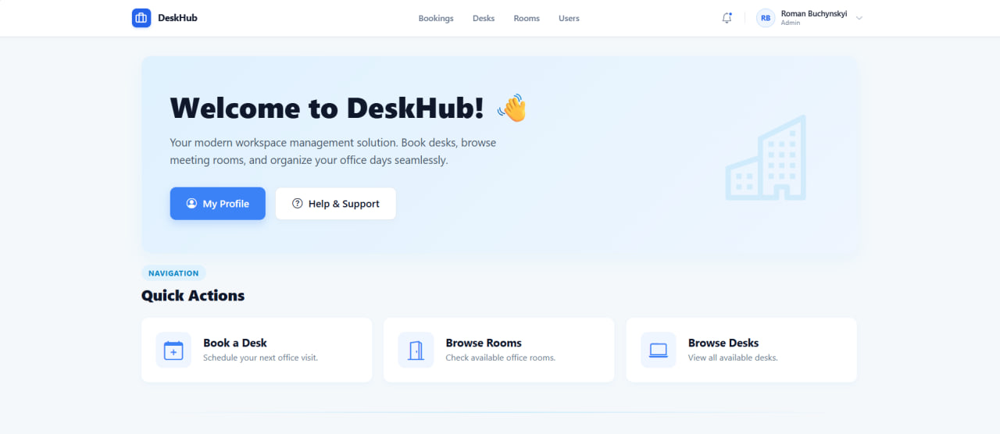
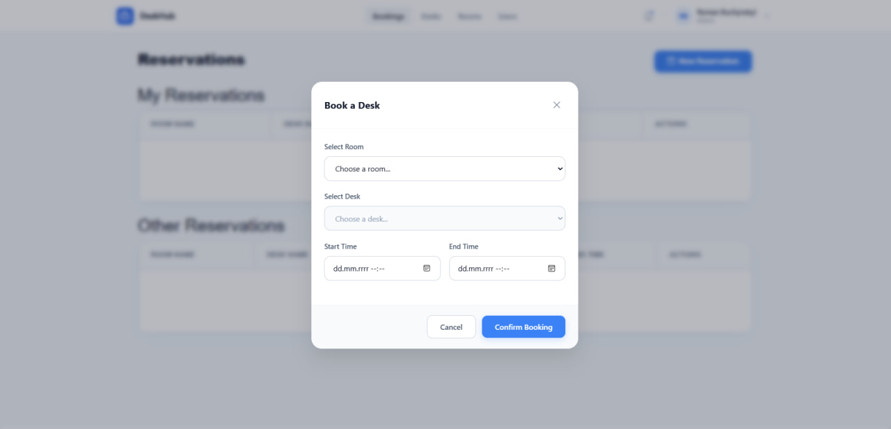
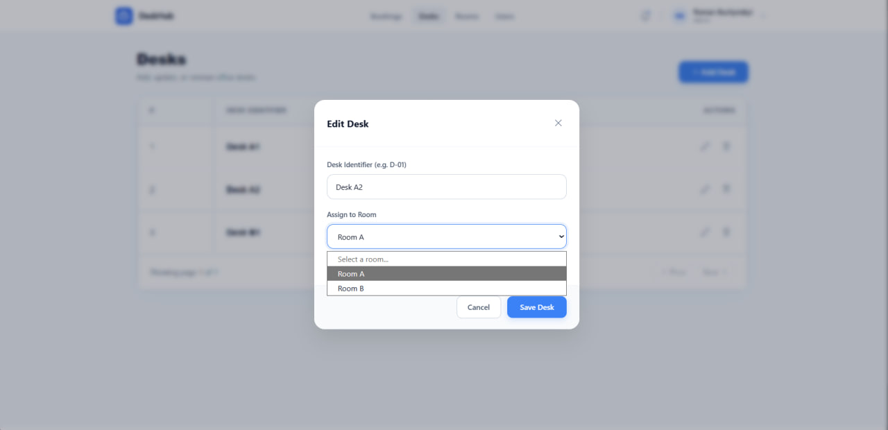
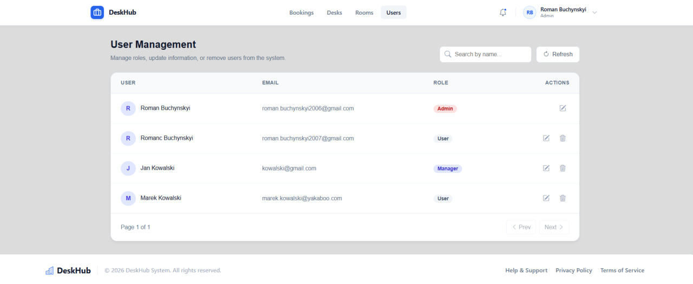

# Office Desk Reservation System
> A comprehensive desk management system designed to facilitate hot-desking and hybrid work models in modern office spaces.
> Live demo [_here_](https://office-desk-ui-roman-gfccd6hgcwhmaeda.polandcentral-01.azurewebsites.net).

## Table of Contents
* [General Information](#general-information)
* [Technologies Used](#technologies-used)
* [Features](#features)
* [Visual Preview](#visual-preview)
* [Setup](#setup)
* [Usage](#usage)
* [Project Status](#project-status)
* [Room for Improvement](#room-for-improvement)
* [Acknowledgements](#acknowledgements)
* [Contact](#contact)

## General Information
- This application helps employees find and book available desks in the office, making it easier to manage shared workspaces when working in a hybrid model.
- The main purpose of this application is to allow employees to quickly view and book desks for specific days, while giving administrators the ability to manage the office layout and user base.
- I undertook this project to practice full-stack development (Angular + .NET) and gain hands-on experience with cloud deployment. The system's architecture leverages Microsoft Azure (App Service for hosting, Azure SQL for the database) and includes unit testing to ensure backend reliability and logic correctness.

## Technologies Used
- **Backend:** .NET 8.0 Web API, Entity Framework Core 8.0
- **Frontend:** Angular 17/18, Tailwind CSS / Bootstrap
- **Database:** Microsoft SQL Server (Azure SQL in Production)
- **DevOps/Cloud:** Microsoft Azure (App Service), Docker, Docker Compose
- **Testing:** xUnit, Moq

## Features
Ready features include:
- **Secure Authentication:** User registration and login using JWT (JSON Web Tokens).
- **Reservation System:** Real-time dashboard to browse and book available desks for specific dates.
- **Admin Dashboard:** Tools for administrators to manage the user list and modify office configurations.
- **Cloud Integration:** Production-ready environment hosted on Azure with automated CORS policies.
- **Reliability:** Backend core logic is covered by unit tests to prevent regressions.

## Visual Preview
### 1. Home Dashboard

*The main landing page showing an overview of the office status and quick navigation.*

### 2. Reservation Management

*The reservation interface where users can select specific desks and dates.*

### 3. Desk Configuration

*Administrative view used to modify desk details, status, and location within the office.*

### 4. User Administration

*A management table for administrators to oversee registered users and their permissions.*

## Setup

### Required Tools
* [Visual Studio 2022](https://visualstudio.microsoft.com/downloads/)
* [.NET 8.0 SDK](https://dotnet.microsoft.com/en-us/download/dotnet/8.0)
* [Node.js](https://nodejs.org/)
* [SQL Server](https://www.microsoft.com/en-us/sql-server/sql-server-downloads)
* [Docker Desktop](https://www.docker.com/products/docker-desktop/)
  
### 1. Clone the Repository
```bash
git clone https://github.com/dramonrog/OfficeDeskReservation.git
```
### 2. Option A: Running with Docker (Recommended)
**Prerequisites:** [Docker Desktop](https://www.docker.com/products/docker-desktop/) installed.

1. In the root directory, run:
   ```bash
   docker-compose up -d --build
   ```
2. The UI will be at `http://localhost:8080` and API/Swagger at `http://localhost:5000/api`.

---

### 3. Option B: Local Manual Setup
**Prerequisites:** .NET 8 SDK, Node.js v18+, and SQL Server (LocalDB or Express).

#### 1. Backend (API) Setup
1. **Navigate to the API folder:**
   ```bash
   cd OfficeDeskReservation.API
   ```
2. **Configure the Database:**
   Open `appsettings.json` and locate the `ConnectionStrings` section. Update it to match your local SQL Server instance.
   *Example for SQL LocalDB:*
   ```json
   "ConnectionStrings": {
     "DefaultConnection": "Server=(localdb)\\mssqllocaldb;Database=OfficeDeskDB;Trusted_Connection=True;MultipleActiveResultSets=true"
   }
   ```
3. **Apply Database Migrations:**
   ```bash
   dotnet ef database update
   ```
   > **💡 Troubleshooting `dotnet ef`:**
   > - **Error: "Command not found":** Run `dotnet tool install --global dotnet-ef`.
   > - **Error: "Inaccessible database":** Ensure your SQL Server service is actually running and your user has permissions. Check the `Server` name in the connection string twice—SQL instances are picky!

4. **Run the Backend:**
   ```bash
   dotnet run
   ```

#### 2. Frontend (UI) Setup
1. **Navigate to the UI folder:**
   ```bash
   cd ../OfficeDeskReservation.UI
   ```
2. **Install Dependencies:**
   ```bash
   npm install
   ```
   > **💡 Troubleshooting `npm`:**
   > - **Dependency Conflicts:** If `npm install` fails due to "peer dependencies," use:
   >   ```bash
   >   npm install --legacy-peer-deps
   >   ```
   > - **Node Version:** Ensure you aren't using an ancient version of Node. Run `node -v` (should be 18+).

3. **Configure the API Endpoint:**
   Open `src/environments/environment.ts` and ensure the `apiUrl` matches your running backend (usually `https://localhost:7xxx` or `http://localhost:5xxx`):
   ```typescript
   export const environment = {
     production: false,
     apiUrl: 'https://localhost:7123/api' // Replace with your actual port
   };
   ```

4. **Launch the Application:**
   ```bash
   npm start
   ```
   The app will open automatically at `http://localhost:4200/`.

---

## Usage

### For Users
Users can register and log in to the system. They can browse available desks for chosen dates and create their own reservations. Personal bookings can be viewed and managed in the "My Reservations" section.

### For Managers
Managers have access to office occupancy data. This role allows for better coordination of team presence and monitoring of how office space is utilized.

### For Administrators
**Default Admin Credentials:**
* **Login:** roman.buchynskyi2006@gmail.com
* **Password:** Admin123!
* Administrators have full access to the system. They can manage the user list, change user roles, and configure rooms and desks (CRUD operations). To access administrative features, a user must have the `Admin` role assigned.
1. **Initial Admin Setup:** - After registering your first account, you can elevate its permissions by updating the `Role` field to `Admin` directly in the `Users` table of your SQL database.
   - *Tip:* In future updates, this can be handled via a secure database seeding script.
2. **Accessing the Admin Panel:** Once logged in as an Admin, the sidebar will expand to include specialized management views:
   - **User Management (`/users`):** View a complete list of registered staff. Administrators can modify user details or manage account permissions.
   - **Office Configuration (`/edit-desk`):** Manage the physical office layout. You can add new desks, update their identifiers.

## Project Status
Project is: _in progress_.  
The core foundation (Database, API, UI, Azure deployment) is stable. Current efforts are focused on improving frontend view, adding messages system and reporting issues system.

## Room for Improvement
- **Responsiveness:** Better mobile and tablet support.
- **Fixing errors:** which are not always displayed in expected way. 

**To do:**
- Message reminders about reservations.
- Email notifications using SendGrid.
- Reporting issues system.
- Fixing errors in profile page and when we are trying to remove desk which is reserved.
- Privacy page.
- Responsive styles.

## Acknowledgements
- Inspired by hybrid workspace management needs.
- Deployment strategies based on official Microsoft Azure documentation.

## Contact
Created by [@dramonrog](https://github.com/dramonrog) - feel free to contact me!
